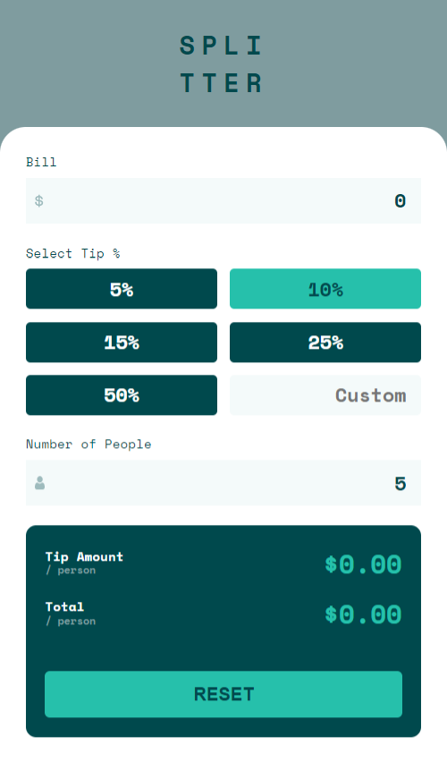
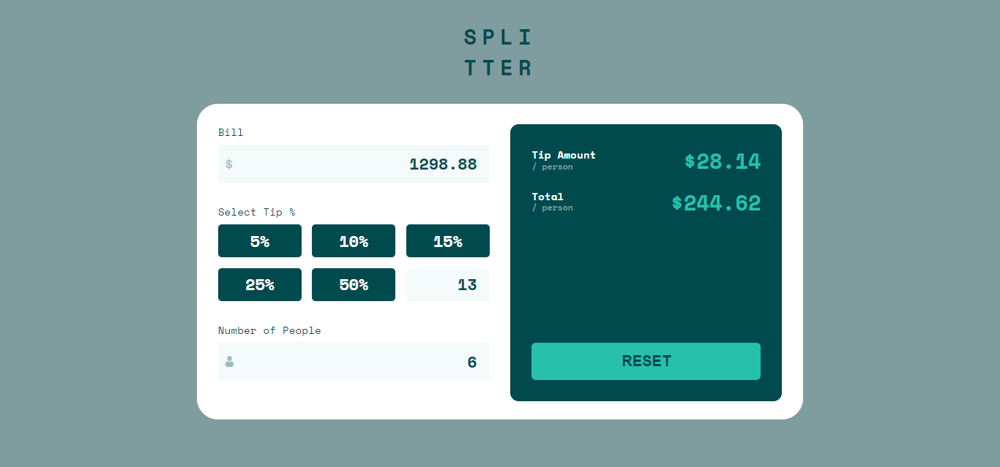

# Frontend Mentor - Tip calculator app solution

This is a solution to the [Tip calculator app challenge on Frontend Mentor](https://www.frontendmentor.io/challenges/tip-calculator-app-ugJNGbJUX). Frontend Mentor challenges help you improve your coding skills by building realistic projects.

## Table of contents

- [Overview](#overview)
  - [The challenge](#the-challenge)
  - [Screenshot](#screenshot)
  - [Links](#links)
- [My process](#my-process)
  - [Built with](#built-with)
  - [What I learned](#what-i-learned)
  - [Continued development](#continued-development)
- [Author](#author)

## Overview

### The challenge

Users should be able to:

- View the optimal layout for the section depending on their device's screen size

### Screenshot

### Links

- Solution URL: [https://github.com/blaqbox-prime/tip-calculator](https://github.com/blaqbox-prime/tip-calculator)

- Live Site URL: [https://blaqbox-prime.github.io/base-apparel-coming-soon](https://blaqbox-prime.github.io/base-apparel-coming-soon)

## My process
I start off with creating color variables in the document root. Then creating the css classes for text colors and background colors. I then analyze the design and chopped it into sections (top and bottom) then split those sections furthur into smaller content containers and start writing the css for those containers as closely as possible to the design. After going as far as I can with the styling I then write the HTML with the classes I've already created. From there everything is adjusted as the HTML is written.

I use a mobile first aproach so the mobile ui is the initial style then a media query for larger screens, 960px+ is used to create the desktop design. For the desktop layout I used flexbox and Grid for the outer (white) container.

### Built with
- React.JS
- Semantic HTML5 markup
- CSS custom properties
- Flexbox
- Mobile-first workflow

### What I learned

It's been good practice for my layout skills. I take quite a bit of time figuring out how to write the css for layouts and style for certain states so, it's been pretty helpful in seeing how much better I could do some things whenever I get stuck. I used react for this project and I always tend to write as little code as possible and at the same time I feel an urgency to rush to the end so whenever there's like no way around it and there's quite a chunk of code I feel uneasy😅 But there's still quite a long way to go with my react journey and I'm thinking of trying bigger projects built with react. 

## Author

- Instagram - [@ig_blaqbox.dev](https://www.instagram.com/ig_blaqbox.dev)
- Frontend Mentor - [@blaqbox-prime](https://www.frontendmentor.io/profile/blaqbox-prime)
- github - [@blaqbox-prime](https://www.github.com/blaqbox-prime)
